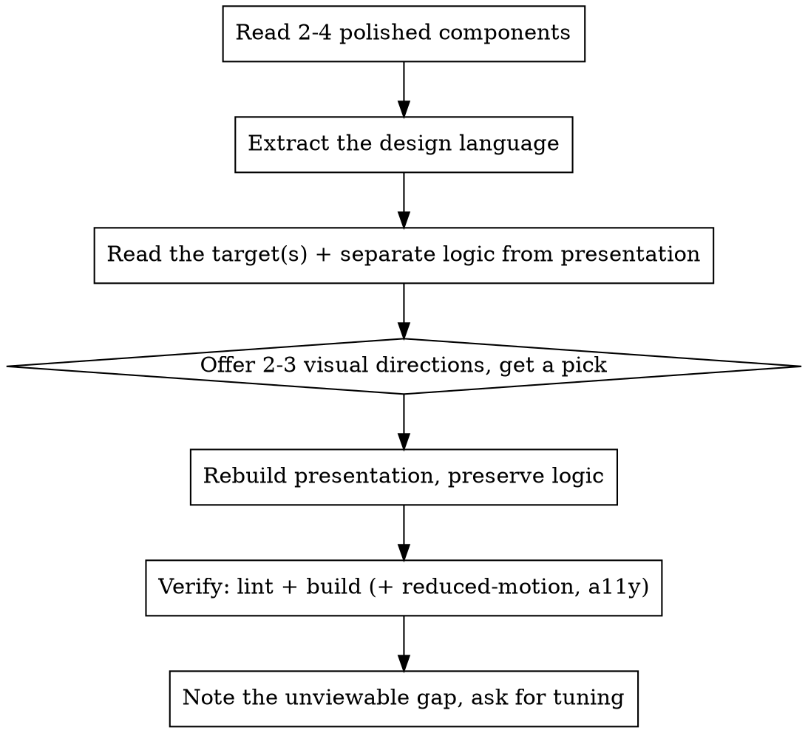

# Matching UI Redesign

Redesign UI so it looks like it was always part of the app — not a new style bolted on. The rule: **the codebase is the style guide.** Extract the design language from what's already polished, then make the target conform.

## When to use

- A component works but looks plain / off-brand ("make the UI better", "redesign this", "polish this screen").
- New components were built function-first and now need to match the rest of the app.
- Aligning spacing, color, type, or motion to an existing design system that lives in the code (not in a separate spec).

Do NOT use this to invent a brand from scratch (that's a design task) or for logic changes (that's a normal feature). This is presentation-only work on top of working logic.

## Core principle: preserve logic, change only presentation

Before touching anything, identify what is **behavior** (state, effects, data fetching, event handlers, props contract) vs **presentation** (className, markup structure, icons, copy, animation). You may freely change presentation. You must keep behavior byte-for-byte unless the user asked otherwise. When you finish, be able to say "logic unchanged — only presentation changed" and mean it.

## Process

### 1. Extract the design language FIRST

Read the most polished, representative components in the app before writing any markup. Look at the hero/marquee component, a card list, and a primary button/CTA. Write down the concrete, reusable tokens you find:

- **Shape:** border radius scale (e.g. `rounded-2xl` cards, `rounded-[1.75rem]` heroes, `rounded-full` pills), border treatment (solid vs dashed), shadows.
- **Color:** the hero/emphasis surface (e.g. black card + white text), muted text token, accent color, filled-vs-outline state pair.
- **Type:** heading font + weight + tracking (e.g. `font-heading font-bold uppercase tracking-[0.25em]`), body size, the small-label convention (e.g. `text-[0.625rem] uppercase tracking-[0.25em] text-white/60`).
- **Motion:** the entrance/interaction animation classes (e.g. `naise-rise`, `[animation-delay:80ms]`, hover `scale-[1.02]`), and where keyframes are defined.
- **Imagery:** how product shots / brand assets are used (e.g. bleeding off a corner, `pointer-events-none absolute`), and where the asset registry lives (e.g. `constants/images.ts`).
- **Idioms:** filled-black-circle vs dashed-outline for done/todo, gradient progress bars, `cn()` for conditional classes, arbitrary values over new CSS.

Also read the project's styling rules if present (CLAUDE.md / AGENTS.md): Tailwind-only? shadcn primitives? inline-style restrictions? Follow them.

### 2. Separate logic from presentation in the target

Read the component(s) being redesigned. Mentally (or in a note) split: the hooks/effects/handlers/props stay; the JSX/classes/icons/copy are fair game. Keep the exported prop signature stable so callers don't break.

### 3. Offer visual directions — don't guess

The single decision that drives everything else is usually the primary element's treatment (the hero card, the main layout). Offer 2-3 concrete directions, each grounded in a pattern you actually found in step 1, and — when it helps — show a tiny ASCII mock of each so the choice is visual, not abstract. Let the user pick. Minor choices (exact spacing, which of two equivalent tokens) you make yourself and mention.

### 4. Rebuild, matching the extracted tokens

Rewrite the presentation using the real tokens, real brand assets, and real animation classes from step 1 — not approximations. Reuse `cn()` and existing helpers. Prefer arbitrary Tailwind values over new CSS files (unless the project keeps keyframes in a global stylesheet — then add them there, consistently with the existing ones).

### 5. Verify

- Run the project's lint on the changed files and its build. Both must pass.
- If you added/changed animation, confirm the `prefers-reduced-motion` fallback still covers it.
- Keep accessibility: meaningful `alt`, `aria-label` on icon-only buttons, focus-visible rings matching the app's convention, heading hierarchy.

### 6. Be honest about the visual gap

You usually cannot SEE the rendered result (auth-gated screens, no running browser). Say so plainly: "verified build + lint, but I couldn't view it rendered — check it on `<route>` and tell me what feels off." Then offer to tune specifics (stamp size, spacing, contrast). Do not claim it "looks great."

## Red flags

- Writing markup before reading the app's existing components — you'll invent a style instead of matching one.
- Introducing a new color, radius, or font that isn't already in the app.
- Changing a hook, effect, handler, or prop contract "while I'm in here" — that's scope creep and risks the logic.
- Claiming the result looks good when you never rendered it.
- Adding a CSS module / new stylesheet when the app expresses everything in Tailwind utilities.

## Output

End with: what changed (presentation only), the design tokens you matched it to, confirmation that logic is unchanged, the verification result, and the honest "I couldn't view it — here's the route to check" note.
